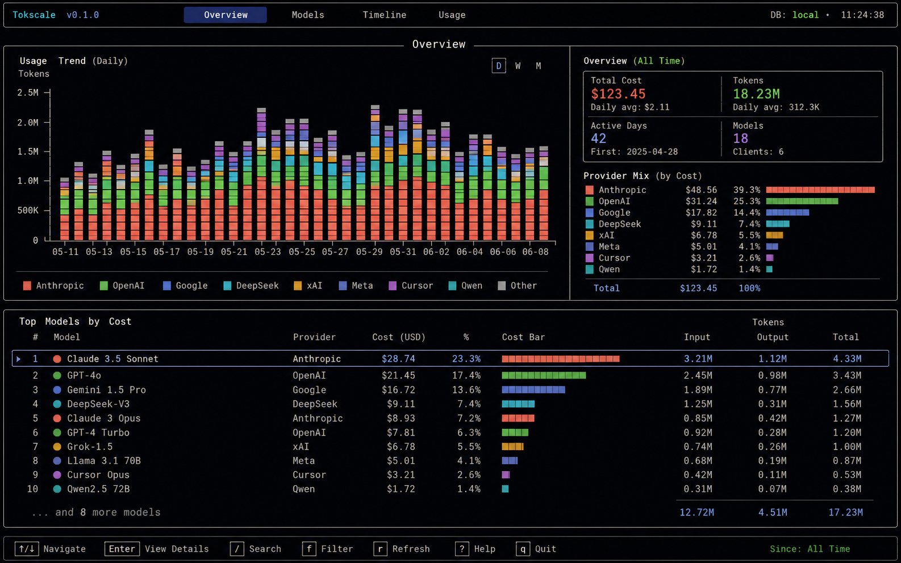
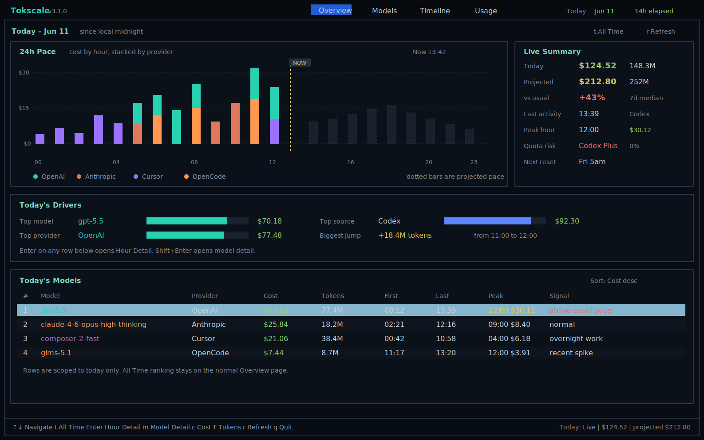
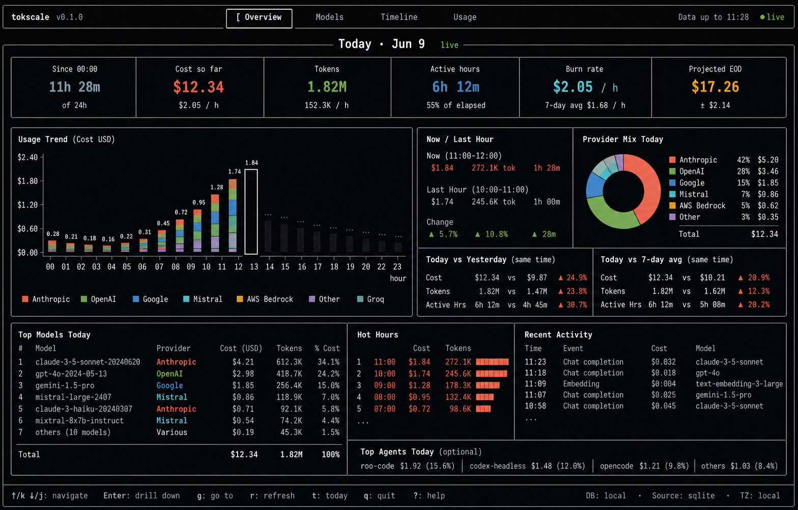
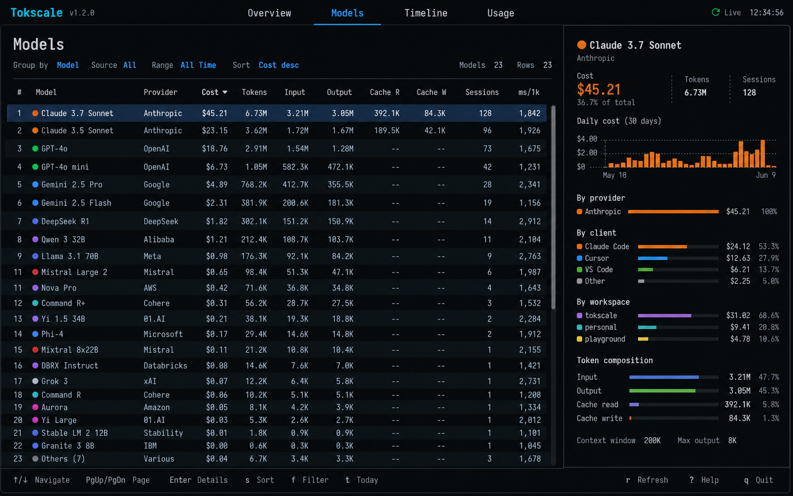
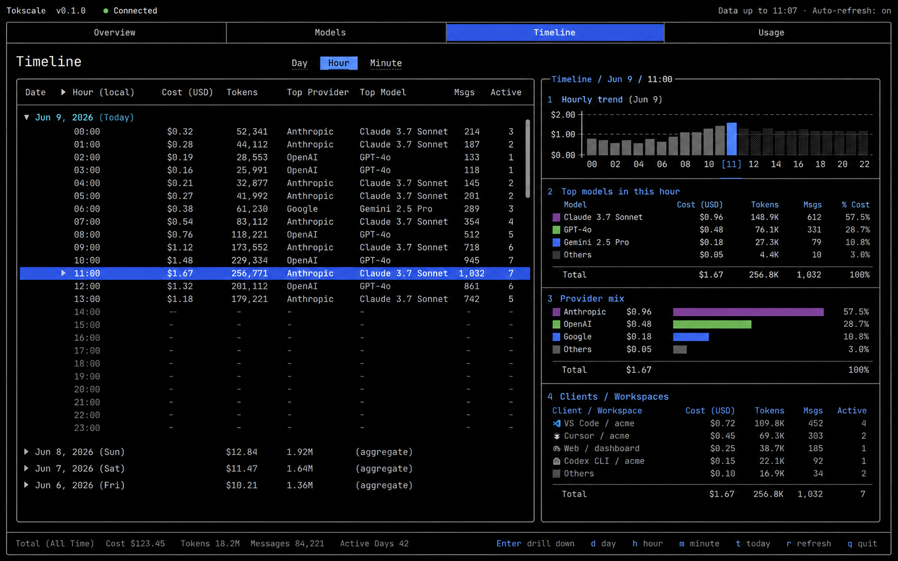
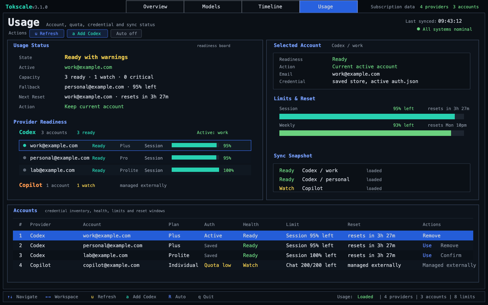
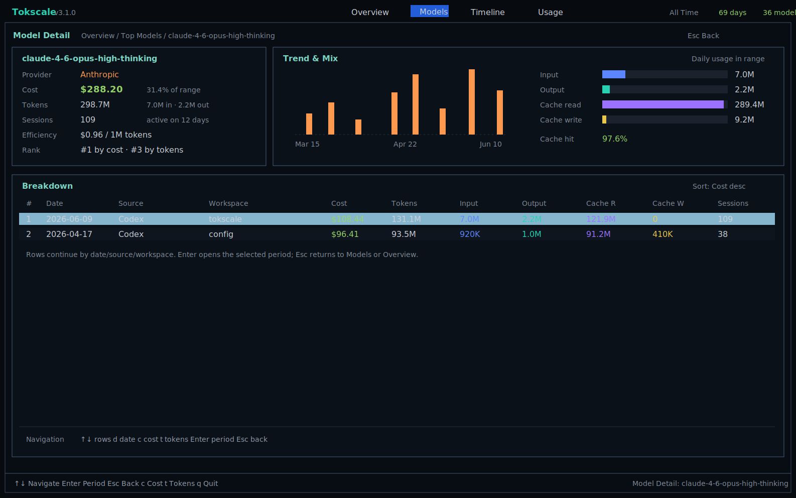
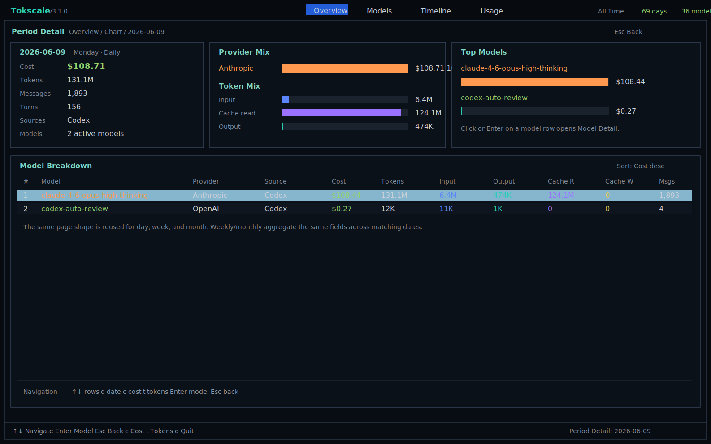
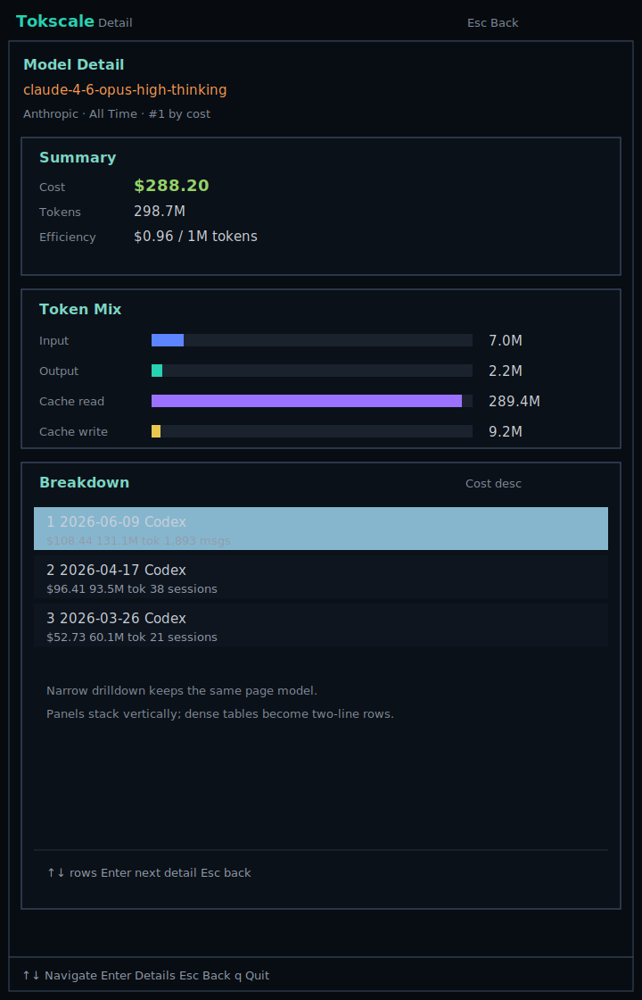

# TUI Design Mockups

These images are directional mockups for the local TUI redesign branch. They define the target information architecture and visual density, not pixel-perfect implementation requirements.

## Overview

All-time/range dashboard target for the default Overview mode.

## Today Mode

Live-focused Overview mode entered with `t` or `--today`.

Earlier Overview-style direction:

## Models

Future model-analysis workspace target: dense table plus selected-row inspector.

## Timeline

Future replacement for separate Daily, Hourly, and Minutely top-level tabs.

## Usage

Operational account/quota/sync status workspace with readiness, fallback, reset, and Codex multi-account controls.

Source SVG: [assets/usage.svg](assets/usage.svg)

## Drilldown

Full-page subviews for explaining selected models and selected time periods without adding more top-level tabs.

Design notes: [drilldown.md](drilldown.md)
